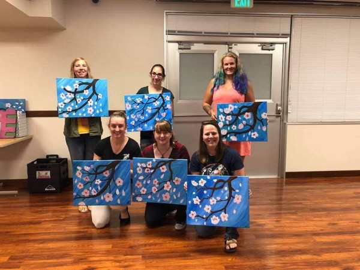
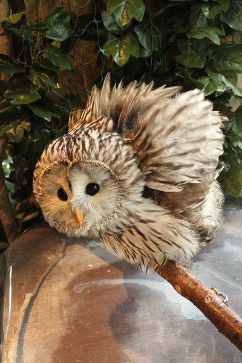

# Hobbies

## ***I have a couple of different hobbies but the two that I would like to talk about are Photography and Painting***

### I first started painting in High School Art class. My Mother that I did not know very well was also a painter. I paint by picture usually which means I look at a photograph and then paint it. I also enjoy doing the painting classes that are popular in the states. 

### I Received my first real camera in December of 2016 as a Christmas gift from my Husband Ian. Ever since that day I have been taking photos with it and even have taken a college course to learn more about photography! I love capturing memories that can last a lifetime!

[Home](index) 
